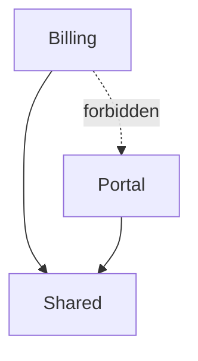
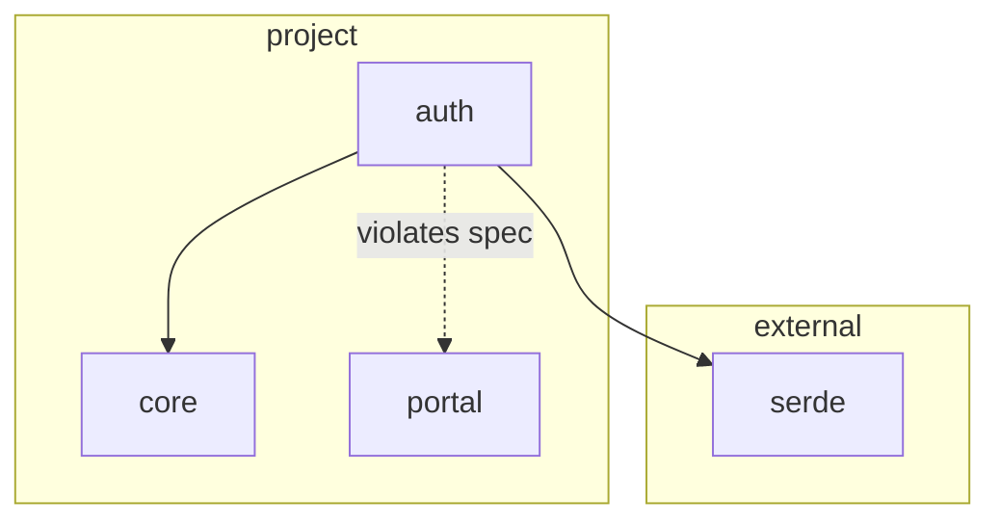

# `diagram` — Output Contract

## Destination

- Default: diagram written to **stdout**, exit code `0`.
- `--output <path>`: diagram written to the file, **stdout stays empty**, exit code `0`.

## Formats

| Flag | Format | Notes |
|---|---|---|
| `--format mermaid` (default) | Mermaid flowchart | `graph TD`, component clusters |
| `--format plantuml` | PlantUML | component packages |

Both formats are deterministic text (ADR-013) — no SVG, no images.

## Diagram structure

The diagram always contains:

1. **One node per component** (declared spec) or **one node per unit** (scan snapshot). Node label is the component or unit name.
2. **One edge per dependency** between them. Edge direction: depending component/unit → depended-upon.
3. **External crates in a separate cluster** (scan mode): dependencies to external crates are grouped into a visually distinct cluster, separated from the project's own nodes. In spec mode there are no external crates — the declared model contains no extracted dependencies.
4. **Violating/forbidden edges marked**: dashed red arrows. In spec mode these are the dependencies the spec declares forbidden. In scan mode these are extracted edges that violate the governing spec's constraints.

Marked edges are the picture's "danger" signal: edges the architecture forbids, either because they are declared banned (spec mode) or because the code has drifted from the declaration (scan mode with a spec present). When no spec forbids anything, no edges are marked.

## Determinism

The same input always produces **byte-identical output**. Node and edge ordering is canonical (nodes by name, edges by from-then-to), independent of any traversal order. Output is safe to commit to version control (see `flows.md`).

Mermaid node ids are collision-proof by construction: names made only of `[A-Za-z0-9_]` keep their bare readable id, while names that need character substitution (`.`, `::`, `/`, `-`, …) carry an 8-hex stability suffix derived from the raw name, so distinct raw names never share an id.

## Example

Declared spec (abbreviated, `../../spec.md`):

```
modules: Billing, Shared, Portal
dependencies: Billing -> Shared, Portal -> Shared
forbidden:   Billing -> Portal
```

Mermaid output (representative):



Node labels are component names; the forbidden edge is dashed. Nested sub-components render as nodes inside their parent component's cluster.

Scan output for a project whose extracted model contains units `auth`, `core`, `portal`, depends on external crate `serde`, and whose governing spec forbids `auth -> portal` (representative):



Node labels are unit names; external crates are grouped in their own cluster; the edge that violates the governing spec is dashed.
