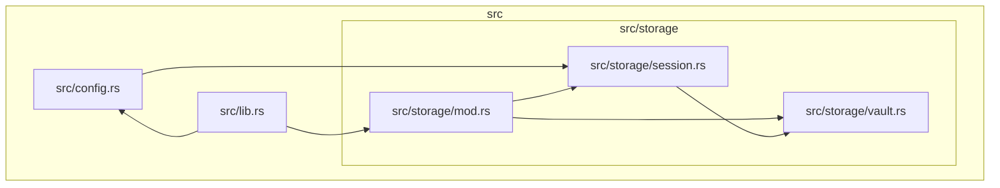

# `inspect` — Output Contract

## Destination

- Default: diagram written to **stdout**, exit code `0`.
- `--output <path>`: diagram written to the file, **stdout stays empty**, exit code `0`. `--output -` prints the diagram on stdout and creates no file.

## Formats

| Flag | Format | Notes |
|---|---|---|
| `--format mermaid` (default) | Mermaid flowchart | `graph TD`, folder subgraphs |
| `--format plantuml` | PlantUML | folder packages |

## Diagram structure

The diagram always contains:

1. **One node per source file**, whose id is the full path relative to the scanned root (e.g. `src/orchestration/common.rs`).
2. **One edge per resolved internal import and one per `mod` declaration** between files (see `resolution.md`). Edge direction: importing or declaring file → imported or declared file.
3. **Folder subgraphs**, recursively mirroring the directory structure. Each subgraph is named by the full relative folder path (e.g. `subgraph src/storage`) and contains its files and nested subgraphs.
4. **Invisible layout links** (`a ~~~ b`) chaining consecutive files within a folder, the last file to the first node of the folder's first subfolder, and consecutive subfolders. They only guide the renderer's vertical stacking — they carry no dependency meaning and draw no visible arrow.

External crate imports are excluded — no external-crate nodes or edges appear.

## Role markers (model modes)

In `tree` and `scanner` modes the diagram declares each unit and module exactly once — as a subgraph header (or `package`) for a unit path and as a node or component line for a module path (undeclared edge endpoints likewise get one declaration line). Where the extracted model's roles map carries a role for a declared path, that declaration line carries a marker:

| Format | Facade | Composition root | Example lines |
|---|---|---|---|
| Mermaid | label suffix `[facade]` | label suffix `[composition]` | `subgraph app["app [facade]"]`, `kit_bin__main_edf44f3e["kit-bin::main [composition]"]` |
| PlantUML | stereotype `<<facade>>` | stereotype `<<composition>>` | `package "app" <<facade>> {`, `component "kit-bin::main" <<composition>>` |

The marker appears exactly once per role-carrying path, on whichever declaration line names it. Node ids, subgraph ids, and every edge line stay unmarked — in PlantUML the identity-binding edge references stay raw, which is why the marker rides a stereotype rather than the name. Paths the roles map does not carry render identically to pre-role output, and the file-level view (default mode) never shows markers: it has no model to read role facts from. The renderer only looks up the map — it derives no roles of its own (the map itself comes from the scan drivers, see *Structural roles* in `../scan/acceptance.md`).

Note that node ids in model modes are generated identifiers (sanitized path plus a short hash suffix), while role markers and human-readable names live in the quoted label — grep the label, not the id:

```bash
archspec inspect tree . | grep -F '"kit-bin::main [composition]"'
```

In the file-level default mode ids *are* the plain relative paths (see Diagram structure above), so this note applies to `tree`/`scanner` output only.

## Excluded paths

The scan never descends into generated, vendored, or hidden directories; their source files do not become nodes, and internal imports that resolve into them are dropped. The set is language-specific and mirrors the matching `scan` driver's rule through one shared predicate so both commands see the same tree for that language: for Rust any directory named `target` or `vendor`, or starting with `.`, is skipped (keeping build artifacts like `target/debug/build/<crate>/out/*.rs` out of the diagram); for C# any directory named `bin`, `obj`, or `node_modules`, or starting with `.`, is skipped; for Go any directory named `vendor` or `testdata`, or starting with `.`, is skipped (the go driver's member list — `node_modules` and `target` are not Go exclusions and stay visible to both commands).

## Determinism

The same input always produces **byte-identical output**. Node and edge ordering is canonical, independent of filesystem traversal order. Output is safe to commit to version control.

## Example

Source tree:

```
crates/auth/src/
├── lib.rs          (declares: pub mod config; pub mod storage;)
├── config.rs       (imports:  use crate::storage::session::Session;)
└── storage/
    ├── mod.rs      (declares: mod session; mod vault;)
    ├── session.rs  (imports:  use super::vault::Vault;)
    └── vault.rs
```

Run from `crates/auth`, the Mermaid output is (exact):



Node ids are the full relative file paths; subgraph names are the full relative folder paths (`src`, `src/storage`); the `~~~` lines are invisible layout links, not dependencies. The visible `-->` edges are the resolved imports (`config.rs`, `session.rs`) plus the `mod` declarations (`lib.rs`, `storage/mod.rs`).
