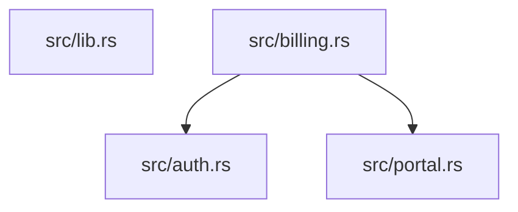

# `report` — Output Contract

## Destination

- Default: report written to **stdout**, exit code `0`.
- `--output <path>`: report written to the file, **stdout stays empty**, exit code `0`. `--output -` prints the report on stdout and creates no file.
- `[output] report` in `archspec.toml`: report written to the configured path
  (relative to the project root), stdout echoes `wrote <path>`, exit code `0`.
  `--output` overrides the config default (see `../../config.md`).

Destination precedence. `--output` always wins — the requested format lands in
the given file whatever it is. A `[output] report` destination is provisioned
for the **text** artefact: that is what a plain `report` writes and what
`report --check` compares against. An explicit `--format` whose format differs
from that (`markdown`, `json`) is therefore printed to **stdout** — a human body
prefixed by `note: destination <path> not written`, a machine body byte-clean
with no status line — and the configured path stays untouched — serializing
JSON into `report.md` would
clobber the committed text report and make `--check` flag it stale. The same
format (`--format text`) behaves exactly as without the flag. `--check` never
writes, so it compares against the resolved destination (`--output`, else the
config path) unchanged.

## Formats

| Flag | Format | Notes |
|---|---|---|
| `--format text` (default) | plain text | monospace, terminal-friendly |
| `--format markdown` | Markdown | renders in review tools, safe to commit as an artefact |
| `--format json` | JSON | machine-readable verdict for CI and automation |

All three formats carry identical metrics, diff, and summary — they serialize
the same in-memory summary + diff the text renderers consume. The Markdown
format additionally embeds the current file-level import-map diagram (Mermaid
code fence) and marks forbidden imports and cycles in their own sections.
Formats are deterministic text; no images, no timestamps.

## Report structure

Every report contains, in order:

1. **Header** — identifies the spec (file name and declared language).
2. **Metrics** — model-derived numbers from the extracted model.
3. **Roles** — the role facts carried by the extracted model, in closed-vocabulary order (`facades`, then `composition roots`), model paths sorted inside each group. The section appears **only when the model carries at least one role**; an empty roles map renders nothing at all.
4. **Violations by category** — the per-category violation counts, in a separate table that appears **only when the run reports at least one violation** (omitted from a clean report).
5. **Diff** — the full structural difference between the extracted and the declared model (ADR-010, `../../../archspec-design.md` §9).
6. **Summary line** — total violations by category, or a clean-result statement.

The Markdown format inserts, between the metrics and the diff:

1. **Roles** (`## Roles`) — the same rows as the text section, as a two-column table (`| Role | Model paths |`), immediately after the metrics table.
2. **Diagram** — the current file-level import-map diagram as a Mermaid code fence (`## Diagram`). Every supported language has a file-level scanner, so the section carries a diagram on any tree.
3. **Forbidden imports** (`## Forbidden imports`) — every forbidden edge present, disallowed cross-component dependency, and facade dependency, each on its own line.
4. **Cycles** (`## Cycles`) — every cycle detected, each on its own line.

### JSON format

`--format json` serializes the same summary + diff for machine consumers:

```json
{
  "language": "rust",
  "metrics": {
    "components": 2,
    "units": 5,
    "edges_internal": 4,
    "edges_external": 2,
    "cycles": 1,
    "violations_components": 0,
    "violations_edges": 1,
    "violations_contracts": 0,
    "violations_cycles": 1
  },
  "roles": {
    "Billing": "facade",
    "Portal::main": "composition"
  },
  "findings": [
    { "category": "forbidden edge present", "severity": "error", "message": "Billing -> Portal" },
    { "category": "cycle detected in", "severity": "error", "message": "Billing -> Portal -> Billing" }
  ]
}
```

- **`findings` is the contract.** One entry per diff line, in the same canonical order the text renderers print, with `category` equal to the label the text report prints (and `help diagnostics` catalogs), `severity` of `error` or `warning` (warning-level entries and vacuous guards are `warning`; everything else `error`), and `message` the rendered detail. Consumers key on categories and severities; the prose inside `message` may evolve, the category ids may not.
- **`metrics` is informational** — the model-summary numbers mirroring the scan model tiers (components, units, internal/external edges, cycles) plus per-category violation counts.
- **`roles` is the model's roles map** (model path → role), positioned between `metrics` and `findings` and serialized **only when the map has entries** — the same skip-when-empty contract the scan model JSON honors. It mirrors scan's `roles` verbatim; the report adds no role facts of its own.
- **`language`** is the spec's declared language.
- The canonical model JSON stays `scan`'s output: the report JSON embeds a summary, never a second full model encoding.

### Metrics

Metrics are derived from the extracted model only — no extra computation, no scoring:

| Metric | Meaning |
|---|---|
| components | number of components in the extracted model |
| units | number of units (hard boundaries) in the extracted model |
| edges (internal) | distinct internal dependency pairs at unit tier (each dependency counted once) |
| edges (external) | dependency edges crossing component boundaries |
| cycles detected | distinct dependency cycles found |

These five numbers are the metric rows. The per-category violation counts are **not** a metric row — they form the separate **Violations by category** table (components, edges, contracts, cycles) that appears only when the total exceeds zero.

**Reading `edges (internal)`.** `edges (internal)` is a pair-union at unit tier: a single-crate tree legitimately prints `0` here while its module graph is rich, because unit-internal module edges add no unit-tier pair. Read module-level coupling from the module-edge views (`depgraph modules`), not from this row; the acceptance contract states the same rule (`acceptance.md` #22, #25).

### Roles

The roles section carries the extracted model's roles map verbatim — nothing is evaluated or judged here, only stated:

```
Roles
-----
facades: app
composition roots: kit-bin::main
```

Row order is the closed vocabulary (`facades`, then `composition roots`); model paths are sorted inside each row and joined with `, `. A role group with no paths contributes no row, and an empty roles map contributes no section — the report never prints a `roles: none` placeholder. Entries are derived per language by the scan drivers and read verbatim here (facade and composition-root derivations, including their language coverage, are stated under *Structural roles* in `../scan/acceptance.md`).

### Diff

The diff reports everything that differs, not the first hit (ADR-010). Each finding is a `<category>: <detail>` line, emitted in canonical order — components, then edges, then contracts, then cycles, then warnings, then vacuous guards. The categories, labelled as the report prints them:

- `missing component` — declared in the spec, absent from the extracted model
- `unexpected component` — extracted but not declared
- `unassigned unit` — extracted unit matched by no declared boundary
- `ambiguous module match` — a module path claimed by two declared boundaries at equal specificity
- `forbidden edge present` — a banned dependency found in the source
- `missing edge` — a required dependency missing from the source (same label verify prints)
- `disallowed cross-component dependency` — a dependency crossing a boundary the spec forbids
- `facade dependency` — an internal module depends on a module carrying the `facade` role in the model's roles map (structural; no constraint declares it; emitted by the rust and csharp drivers — each derives facade roles from its own facts; the go driver derives no facade role, so the rule never fires there)
- `contract leak` — exposed surface bleeds outside the declared contract; the submodule form needs the module tier (rust, csharp, and go — the go driver derives one from the tree's package references, takes it natively from go.work members, or takes it from spec modules claiming its packages on a tree recording none)
- `cycle detected in` — a `no_cycles` violation; the cycle path is joined with ` -> ` and repeats the closing node (e.g. `Billing -> Portal -> Billing`)
- `vacuous constraint` — a constraint whose effective domain is empty (nothing to check)

Warning-severity findings are report content too and are listed verbatim under their own category label — `dead reference`, `laundered forbidden edge`, `unresolved module file`, and `unowned module edge endpoint`. A warning-severity cycle renders exactly like an error-level `cycle detected in` line. `report` is informational and has no `--strict` gate, so warnings never escalate. Language coverage of the warnings: `laundered forbidden edge` and `unowned module edge endpoint` need the module tier and are emitted by rust, csharp, and go once the tree has one (go.work members, the tree's own package references, or spec modules on a tree recording none); `unresolved module file` is a rust-driver finding; a tier-less go tree produces none of them. `dead reference` entries are emitted by every driver; the verdict follows the driver's visibility capability, not its name — on a tree whose module-tier fact the driver does not emit granularly the entry reads `not verifiable from source — driver emits no module-tier fact for this tree` instead of claiming the target `does not exist`.

When nothing differs, the diff section states that no violations were found.

## Determinism

The same input always produces **byte-identical output**. Metric ordering, diff ordering, and formatting are canonical, independent of filesystem traversal order. No timestamps, no host-specific content. Output is safe to commit to version control as a review artefact.

## Exit code

A successful run exits `0` when the code satisfies its spec. **Error-level rule violations exit non-zero** — the report is still written in full first (violations are report content, not an operational failure). Warning-level findings and vacuous constraints never affect the exit code: `report` is informational and has no `--strict` gate, so a warnings-only run exits `0`. Operational failures exit non-zero without producing a report (see `errors.md`).

## Examples

Given a spec declaring modules `Billing` and `Portal` and a source tree where code adds a forbidden edge `Billing -> Portal` plus a cycle, the text output is (representative):

```
Architecture report
===================

Spec: architecture.spec.toml (language: rust)

Metrics
-------
components:          2
units:               5
edges (internal):    4
edges (external):    2
cycles detected:     1

Violations by category
----------------------
edges:     1
cycles:    1

Diff: extracted vs declared
---------------------------
forbidden edge present: Billing -> Portal
cycle detected in: Billing -> Portal -> Billing

Result: 2 violations (1 edge, 1 cycle)
```

When the extracted model matches the declared spec exactly, the report states it plainly:

```
Diff: extracted vs declared
---------------------------
no violations found

Result: clean
```

The Markdown format carries the same content plus the marked sections:

```markdown
# Architecture report

Spec: `architecture.spec.toml` (language: rust)

## Metrics

| Metric | Value |
|---|---|
| components | 2 |
| units | 5 |
| edges (internal) | 4 |
| edges (external) | 2 |
| cycles detected | 1 |

## Violations by category

| Category | Count |
|---|---|
| edges | 1 |
| cycles | 1 |

## Diagram



## Forbidden imports

- `Billing -> Portal`

## Cycles

- `Billing -> Portal -> Billing`

## Diff: extracted vs declared

- forbidden edge present: `Billing -> Portal`
- cycle detected in: `Billing -> Portal -> Billing`

**Result:** 2 violations (1 edge, 1 cycle)
```

The JSON format carries the same findings as structured entries (see *JSON format* above); the example above serializes as the two `findings` entries shown there, with the metrics block mirroring the metric rows.

The header, metrics, diff, and summary appear in every report; their content is a pure function of the extracted model and the spec.
